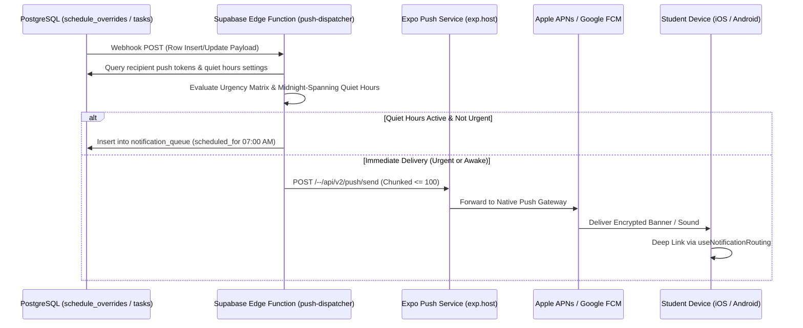

# ClassSync — Master Project Study Guide (`study_guide.md`)

> **Welcome to the ClassSync Engineering Study Guide!**  
> This guide breaks down the entire project from first principles. Whether you are reviewing this code before an interview, presenting it for an academic defense, or brushing up on modern mobile system design, this guide covers *how* every piece works, *why* it was built that way, and the core computer science concepts behind it.

---

## Table of Contents
1. [Core Product Mental Model & EdTech Problem Space](#1-core-product-mental-model--edtech-problem-space)
2. [The Timetable Scheduling Engine: Math & Resolution](#2-the-timetable-scheduling-engine-math--resolution)
3. [Authentication Architecture: Clerk to Supabase JWT Bridge](#3-authentication-architecture-clerk-to-supabase-jwt-bridge)
4. [PostgreSQL Schema & Row Level Security (RLS) Deep Dive](#4-postgresql-schema--row-level-security-rls-deep-dive)
5. [Real-Time WebSocket Sync & CDC Architecture](#5-real-time-websocket-sync--cdc-architecture)
6. [Push Notifications, Database Webhooks & Quiet Hours](#6-push-notifications-database-webhooks--quiet-hours)
7. [Offline-First Local Storage Engine (SQLite + MMKV)](#7-offline-first-local-storage-engine-sqlite--mmkv)
8. [Timezone Mathematics & Daylight Saving Time Immunity](#8-timezone-mathematics--daylight-saving-time-immunity)
9. [System Design Defense & Interview Q&A](#9-system-design-defense--interview-qa)
10. [Design System Architecture: Soft UI & Floating Navigation](#10-design-system-architecture-soft-ui--floating-navigation)
11. [Dynamic Calendar Mathematics & Automated A/B Parity Engine](#11-dynamic-calendar-mathematics--automated-ab-parity-engine)
12. [Client Schedule Compilation Engine & Realtime Subscription Hygiene](#12-client-schedule-compilation-engine--realtime-subscription-hygiene)
13. [Exception Broadcast UX & Soft Badging Architecture](#13-exception-broadcast-ux--soft-badging-architecture)
14. [Client Schedule Verification Protocol & Static Analysis Defense](#14-client-schedule-verification-protocol--static-analysis-defense)
15. [Realtime Channel Collision Defense & Modal Ergonomics](#15-realtime-channel-collision-defense--modal-ergonomics)
16. [Academic Tasks & Deadline Categorization Engine](#16-academic-tasks--deadline-categorization-engine)
17. [Attendance Tracking Architecture & The PostgreSQL NULL Uniqueness Trap](#17-attendance-tracking-architecture--the-postgresql-null-uniqueness-trap)
18. [The Bunk Calculator: Mathematical Derivations & Precision Protection](#18-the-bunk-calculator-mathematical-derivations--precision-protection)
19. [Expo Router Lifecycle & The Unconditional Navigator Invariant](#19-expo-router-lifecycle--the-unconditional-navigator-invariant)

---

## 1. Core Product Mental Model & EdTech Problem Space

### Why existing university tools fail:
1. **WhatsApp / Telegram / Discord:** Highly active but noisy. An announcement that *"Class is moved to Hall 3"* is buried in 150 memes and casual chatter within 10 minutes.
2. **LMS (Canvas, Blackboard, Moodle):** Clunky enterprise software designed for grading and term-long file submissions, not live, agile, 2-minute status updates.
3. **Static Spreadsheets / PDFs:** Excel timetables fail the moment a professor falls sick, a room is double-booked, or a national holiday shifts schedules.

### The ClassSync Philosophy:
- **Peer-Orchestrated (Decentralized):** Rather than waiting for slow university IT departments, student leaders (Class Admins / Delegates) manage their own cohort directly from their phones.
- **Zero Data Entry for Students:** 95% of students do nothing except scan a QR code or tap a link. Their entire semester agenda is instantly populated and stays up-to-date automatically.
- **Deterministic Resolution:** A strict mathematical model separates the *recurring baseline* from *real-time exceptions*.

---

## 2. The Timetable Scheduling Engine: Math & Resolution

### The Mental Model: Base vs. Override vs. Makeup
Instead of treating each day as a separate calendar event, ClassSync uses a 3-tier layering model:

```
[ Tier 1: Base Loop ]  ──► Recurring weekly template (Mon 10:00 AM, Room 101)
         │
         ▼
[ Tier 2: Date Exceptions ] ──► Specific date overrides (2026-10-12: CANCELLED or DELAYED +15m)
         │
         ▼
[ Tier 3: Makeup Events ]   ──► Standalone ad-hoc sessions (2026-10-15: Makeup Lab 4:00 PM)
```

### The Resolution Algorithm (Client-Side)
When the student opens their app for a specific date \( D \):
1. **Identify Day of Week:** Calculate \( \text{DayOfWeek}(D) \in [1..7] \) in the workspace timezone.
2. **Determine Week Cycle (Weekly vs. A/B Alternating):**
   - For standard weekly: All matching base items apply.
   - For A/B week schedules: Calculate elapsed weeks between \( D \) and `week_a_anchor_date`:
     $$\text{WeekIndex} = \left\lfloor \frac{D - \text{AnchorDate}}{7 \text{ days}} \right\rfloor$$
     $$\text{Cycle} = \begin{cases} \text{'A'} & \text{if } \text{WeekIndex} \pmod 2 = 0 \\ \text{'B'} & \text{if } \text{WeekIndex} \pmod 2 = 1 \end{cases}$$
3. **Filter by User Course Toggles:** Check if the student has marked `is_muted = true` for that course. If muted, skip.
4. **Apply Date-Specific Exceptions:** Search `schedule_overrides` where `override_date = D` and `base_schedule_id = item.id`.
   - If `status = CANCELLED`: Exclude or flag card as cancelled.
   - If `status = DELAYED`: Add `delay_minutes` to start time.
   - If `new_room` is present: Override room location.
5. **Inject Ad-Hoc Makeups:** Query `schedule_overrides` where `override_date = D` and `is_makeup = true`.

### Interval Collision Mathematics & Parity Compatibility

In the Timetable Builder (`conflictDetector.ts`), real-time collision detection runs on every keystroke and duration change.

1. **Time to Integer Representation:**
   Every `HH:MM` timestamp is converted into total minutes from midnight:
   $$\text{minutesFromMidnight}(H, M) = H \times 60 + M$$
   For example, `09:00` $\rightarrow$ 540, and `10:30` $\rightarrow$ 630.

2. **Interval Intersection Formula:**
   Two intervals $[S_1, E_1)$ and $[S_2, E_2)$ on the same day overlap **if and only if**:
   $$\max(S_1, S_2) < \min(E_1, E_2)$$
   - **Back-to-Back Adjacency:** If Class 1 ends at 10:30 ($E_1 = 630$) and Class 2 starts at 10:30 ($S_2 = 630$), then $\max(540, 630) = 630$ and $\min(630, 720) = 630$. Because $630 < 630$ is **false**, back-to-back classes correctly evaluate to **no collision**.

3. **Parity Compatibility Matrix:**
   Classes that run on different bi-weekly cycles do not occupy the physical room or student schedule at the same time:
   | Block 1 Frequency | Block 2 Frequency | Can Conflict? | Notes |
   | :--- | :--- | :--- | :--- |
   | `weekly` | `weekly` | **Yes** | Standard same-day weekly collision |
   | `weekly` | `week_a` / `week_b` | **Yes** | Weekly class collides with bi-weekly session |
   | `week_a` | `week_a` | **Yes** | Same bi-weekly cycle collision |
   | `week_b` | `week_b` | **Yes** | Same bi-weekly cycle collision |
   | `week_a` | `week_b` | **No** | Disjoint weeks; never collide in reality |

4. **Soft-Clash Warning vs. Hard Blocking:**
   The collision detector returns `{ hasConflict: boolean, conflictingBlock?: BaseSchedule }`. If true, the UI displays an amber warning banner detailing the overlap, but retains an enabled "Add to Schedule" / "Save Changes" button. This allows university CRs to support cohort splitting (e.g. half the class in Lab A, half in Lab B at the exact same hour).

5. **Day Cloning Logic:**
   The `clone_day_schedule(target_section_id, source_day, target_day, overwrite_target)` PostgreSQL RPC duplicates recurring blocks from a source weekday to a target weekday. If `overwrite_target = true`, existing blocks on `target_day` are deleted within the transaction before inserting cloned rows. If source day has 0 blocks, the UI disables the clone CTA to prevent accidental wiping of target schedules.

---

## 3. Authentication Architecture: Clerk to Supabase JWT Bridge

### How Clerk and Supabase Work Together
ClassSync decouples **Identity Management** (Clerk) from **Data Persistence & RLS** (Supabase).

```
1. Mobile App (Clerk Expo SDK)
   │
   ├─► User logs in with Google or Apple
   │
   ├─► Clerk issues Session Token
   │
   └─► App requests custom JWT: session.getToken({ template: 'supabase' })
            │
            ▼
2. Custom Supabase Client (React Native)
   │
   └─► Injects Authorization header: `Bearer <clerk_jwt>`
            │
            ▼
3. Supabase Gateway (PostgREST)
   │
   ├─► Verifies JWT signature using Clerk's JWKS / Secret Key
   │
   └─► Extracts claims into PostgreSQL session:
       `auth.jwt() ->> 'sub'` === Clerk User ID (`user_2N...`)
```

### Why this is superior:
- **No sync webhooks required for login:** Supabase doesn't need to replicate Clerk's password hashes. The JWT signature is mathematically verified on every request.
- **Apple Store Compliance:** Clerk handles native Apple Sign-In seamlessly, fulfilling Section 4.8 of the App Store Review Guidelines.

---

## 4. PostgreSQL Schema & Row Level Security (RLS) Deep Dive

### Row Level Security (RLS) Concepts
In standard web apps, security logic lives in API route middleware (Node.js/Express). If a developer forgets an `if (!user.isAdmin)` check in one endpoint, data leaks.  
In ClassSync, **security is enforced directly inside the database kernel via PostgreSQL RLS**.

### Key RLS Functions:
```sql
-- Extracts Clerk user ID from the request JWT claims
create or replace function public.current_user_id()
returns text language sql stable as $$
  select nullif(current_setting('request.jwt.claims', true)::jsonb ->> 'sub', '');
$$;

-- Security Definer function: Checks if the user is Lead or Co-Admin of a workspace
create or replace function public.is_workspace_admin(ws_id uuid)
returns boolean language sql security definer as $$
  select exists (
    select 1 from public.workspace_members
    where workspace_id = ws_id
      and user_id = public.current_user_id()
      and role in ('lead_admin', 'co_admin')
  );
$$;
```

> **Security Definer vs. Security Invoker:**  
> A `security definer` function runs with the privileges of the function creator (database owner), bypassing RLS during its internal check. This prevents infinite recursion when an RLS policy needs to check a membership table that itself has RLS enabled!

### Guest Isolation Guarantee:
When an irregular student joins only *"Database Systems"* via a guest invite token:
- They are added to `course_enrollments` with `membership_type = 'course_guest'`.
- They are **NOT** added to `workspace_members`.
- The RLS policy on `courses` checks:
  ```sql
  create policy "Users can view enrolled courses or cohort courses"
  on public.courses for select
  using (
    is_workspace_member(workspace_id)
    or is_course_member(id)
  );
  ```
- Because the guest is only a course member for that specific ID, all other courses and cohort members in that workspace return zero rows.

---

## 5. Real-Time WebSocket Sync & CDC Architecture

### How Real-Time Works Under the Hood
1. **PostgreSQL WAL (Write-Ahead Log):** Every time an Admin changes a status, PostgreSQL writes the change to disk in its WAL.
2. **Supabase Realtime (Elixir Phoenix Server):** Tails the PostgreSQL WAL using logical decoding (`wal2json` / `pgoutput`).
3. **WebSocket Broadcast:** The Phoenix server pushes the change over an open WebSocket connection directly to connected mobile devices.
4. **Client Reactivity:** The React Native app listens on the `workspace:{id}` channel and invalidates the TanStack Query cache, triggering a smooth re-render via React Native Reanimated in <300ms.

---

## 6. Push Notifications, Database Webhooks & Quiet Hours

### The Notification Pipeline
```
Admin taps "Cancelled" 
   │
   ▼
`schedule_overrides` row updated in Supabase PostgreSQL
   │
   ▼
Database Webhook (pg_net) triggers Supabase Edge Function
   │
   ▼
Supabase Edge Function (`push-dispatcher`):
   1. Queries `course_enrollments` where `course_id = NEW.course_id` AND `is_muted = false`
   2. Joins `user_push_tokens` to get active device tokens and local timezones
   3. Quiet Hours Filter:
      - Is it between 10:00 PM and 7:00 AM in the recipient's timezone?
      - If YES and status is URGENT (cancelled, delayed, room moved today) ──► SEND IMMEDIATELY
      - If YES and status is NON-URGENT (general note, future task) ──► QUEUE FOR 7:30 AM
   4. Batches tokens into chunks of 100
   5. Dispatches POST request to `https://exp.host/--/api/v2/push/send`
   │
   ▼
Apple APNs / Google FCM servers deliver push alert to student lock screens in <2.5s
```

---

## 7. Offline-First Local Storage Engine (SQLite + MMKV)

### Why Mobile Apps Must Be Offline-First
Students frequently spend hours in university basements, lecture theaters with thick concrete walls, or libraries with spotty Wi-Fi. An app that displays a white spinner when offline is useless.

### The Hydration & Sync Lifecycle:
1. **Launch Phase (0–100ms):**
   - App reads directly from local **Expo SQLite**.
   - The UI immediately renders today's agenda using the cached Base Schedule and known Overrides.
2. **Network Phase (Background):**
   - When network connectivity is confirmed via `@react-native-community/netinfo`, the client queries Supabase:
     ```sql
     select * from schedule_overrides 
     where course_id in (...) and updated_at > :last_sync_timestamp;
     ```
   - Only delta changes (new/modified rows) are returned, minimizing battery and mobile data consumption.
   - SQLite is updated with the delta, and the in-memory Zustand store triggers a re-render.
3. **Offline Mutation Queue:**
   - If a student checks off an assignment while offline, the action is written to a local `offline_mutations` table in SQLite.
   - Once online, a background sync worker replays queued mutations to Supabase in FIFO order.

---

## 8. Timezone Mathematics & Daylight Saving Time Immunity

### The Bug in Naive Implementations:
If a class is scheduled for "Monday 10:00 AM" in London and stored as UTC:
- In Winter (GMT / UTC+0): 10:00 AM UTC = 10:00 AM London.
- In Summer (BST / UTC+1): 10:00 AM UTC = **11:00 AM London**!  
The student arrives 1 hour late because Daylight Saving Time shifted the UTC offset.

### The ClassSync Architecture:
- `workspaces` stores the official IANA Timezone string (e.g., `Europe/London`, `America/New_York`, `Asia/Karachi`).
- `base_schedules` stores `start_time` and `end_time` as `time without time zone` (e.g., `10:00:00`).
- This means the class is **mathematically anchored to the university's local wall-clock time**, guaranteeing 100% immunity against Daylight Saving Time shifts.

---

## 9. System Design Defense & Interview Q&A

### Q1: Why did you choose React Native (Expo) over Flutter or Native Swift/Kotlin?
**Answer:** ClassSync requires rapid cross-platform deployment on both the Apple App Store and Google Play Store with a single engineering team. Expo provides modern native toolchains (Expo Router, Expo SecureStore, Expo SQLite, and Expo Push Notifications) that compile down to native iOS and Android primitives while sharing 98% of TypeScript business logic, models, and RLS types.

### Q2: Why not just use Google Calendar or Apple Calendar directly?
**Answer:** Standard calendars lack the **peer-driven cohort permission model**. In Google Calendar, either one person owns the calendar (and everyone has to manually subscribe via .ics links that refresh only every 12-24 hours), or everyone has edit access (leading to accidental deletion). ClassSync provides sub-second live overrides, granular course toggles, and dedicated edtech workflows (quizzes, assignments, peer verification) built specifically for student cohorts.

### Q3: How do you prevent malicious status overrides (e.g., a student falsely marking a class as cancelled)?
**Answer:** Status updates to `schedule_overrides` are strictly protected at the database level by PostgreSQL Row Level Security (`is_workspace_admin`). Only students who have been verified and promoted to `lead_admin` or `co_admin` in `workspace_members` possess write permissions. Regular members can only submit crowd-sourced "Peer Reports", which require corroboration from at least 3 distinct cohort members before displaying a provisional badge.

### Q4: How does the system handle high concurrency during morning class hours?
**Answer:** Because the Base Schedule is cached locally on device SQLite, 95% of read traffic never touches the database. When a status override occurs, Supabase broadcasts the update via WebSocket Phoenix Channels (pub/sub), which easily handles tens of thousands of concurrent connections with minimal database query load.

### Q5: How does the Conflict Detection Engine determine time collisions in real time?
**Answer:** ClassSync avoids heavy date arithmetic by converting times to minutes from midnight ($H \times 60 + M$). It checks interval intersection using $\max(S_1, S_2) < \min(E_1, E_2)$ paired with a parity compatibility matrix. Back-to-back classes ($E_1 = S_2$) evaluate to strict inequality ($<$ vs $\le$), guaranteeing that zero false-positive collisions are triggered when one lecture finishes at the exact minute the next begins. The check runs in $O(N)$ against the section's active day blocks, executing in sub-millisecond time.

### Q6: Why did you implement a Soft Clash (warning banner with override permission) rather than a hard database exclusion constraint?
**Answer:** University class cohorts often split into sub-groups (e.g. 50 students split into Lab Group A in Room CS-1 and Lab Group B in Room CS-2 at the exact same hour). A hard PostgreSQL exclusion constraint would reject the second group, making it impossible for the Class Admin to record the full schedule. The soft-clash model flags the collision in amber to prevent accidental double-booking while giving administrators full autonomy to save intentional overlaps.

### Q7: How does ClassSync resolve schedules for guest students who join only a specific course without joining a section?
**Answer:** ClassSync employs a dual-source schedule query in `useBaseSchedule.ts`. For standard cohort members, it queries `base_schedules` by `section_id = activeSectionId`. Concurrently or as a fallback for guest students, it queries `base_schedules` where `course_id` is included in the user's enrolled `activeCourses` list. The results are merged and deduplicated by block ID, ensuring irregular students have their schedules populated without seeing data from other courses in the section.

### Q8: How does ClassSync guarantee safe area compliance across diverse mobile form factors without UI clipping?
**Answer:** ClassSync standardizes on `react-native-safe-area-context` over the deprecated React Native core `SafeAreaView`. Root tab screens apply `edges={['top', 'left', 'right']}` while floating navigation docks query dynamic bottom insets (`Math.max(insets.bottom, 14)`). Scroll views incorporate `contentContainerStyle={{ paddingBottom: 110 }}` so bottom elements are never occluded by floating capsules. Modals apply explicit edge boundaries with circular dismiss controls.

---

## 10. Design System Architecture: Soft UI & Floating Navigation

### Core Philosophy
University life is often chaotic; academic productivity software should bring calm and order. ClassSync adopts a **Soft Luxury Design System**:
- **Canvas:** Ultra-soft off-white background (`#F8F9FA`) to reduce contrast harshness compared to pure `#FFFFFF`.
- **Card Hierarchy:** Floating white containers (`bg-white rounded-3xl border border-neutral-100/90 shadow-2xs`) that subtly elevate from the canvas.
- **Pill Primitives:** Interactive elements utilize `rounded-full` capsules with bold, high-contrast active states (`bg-neutral-900 text-white`) and quiet inactive states (`bg-white text-neutral-700`).
- **Pastel Palette Semantics:**
  - *Lecture:* Muted Sky Blue (`#EEF6FF` / `#2563EB`)
  - *Lab:* Mint Green (`#EDFAF3` / `#059669`)
  - *Break / Recess:* Soft Peach (`#FEF7EC` / `#D97706`)
  - *Prayer:* Soft Teal / Sage (`#EBF7F6` / `#0D9488`)
  - *Cohort Meeting:* Soft Lavender (`#F4EEFD` / `#7C3AED`)
  - *Tutorial / Seminar:* Soft Rose (`#FEF1F3` / `#E11D48`)
- **Vertical Timeline Mechanics:**
  - Left column: Time axis displaying exact session start and end times in local wall-clock format.
  - Center axis: Sleek vertical timeline track with indicator nodes marking session commencement.
  - Right column: Floating pastel card containing course title, session type pill, duration indicator, room tag, and instructor badge.

---

## 11. Dynamic Calendar Mathematics & Automated A/B Parity Engine

### The Problem Space: Bi-Weekly Cycles & DST Vulnerabilities
Institutions worldwide alternate schedules bi-weekly (e.g. Week A has Physics Lab on Tuesday, Week B has Chemistry Lab). If calculated naively using timestamp division:
$$\text{elapsedWeeks} = \left\lfloor \frac{T_1 - T_0}{7 \times 86400000} \right\rfloor$$
This computation breaks when:
1. **Daylight Saving Time (DST) Transitions:** In March/November, clocks jump forward or backward by 1 hour, making a 7-day interval 167 or 169 hours instead of 168 hours.
2. **Pre-Semester Dates:** When testing or viewing schedules prior to the `week_a_anchor_date` ($T_1 < T_0$), standard JavaScript `%` (modulo) returns negative numbers (e.g., `-1 % 2 = -1`), which fails parity mapping.

### The Pure UTC Monday Calendar Normalization Algorithm
In `calendarUtils.ts`, ClassSync guarantees 100% DST immunity and cross-timezone accuracy through a 3-step normalization:

1. **Parse to UTC Year, Month, Day:**
   Extract pure integer components $(Y, M, D)$ without local machine timezone interference using `Date.UTC(Y, M - 1, D)`.
2. **Normalize to Respective Week's Monday:**
   Determine the ISO day index ($0 = \text{Sun}, 1 = \text{Mon}, \dots, 6 = \text{Sat}$) in UTC:
   $$\text{daysFromMonday} = (\text{utcDay} + 6) \pmod 7$$
   Subtract `daysFromMonday` from the UTC timestamp:
   $$M_{\text{norm}} = M_{\text{utc}} - (\text{daysFromMonday} \times 86400000)$$
   Now, every day of a calendar week maps to the exact same normalized Monday timestamp.
3. **Whole Calendar Days & Symmetrical Modulo:**
   Calculate calendar weeks elapsed:
   $$\Delta W = \text{round}\left(\frac{M_{\text{norm}}^{\text{target}} - M_{\text{norm}}^{\text{anchor}}}{7 \times 86400000}\right)$$
   Apply symmetrical Euclidean modulo arithmetic:
   $$\text{parityIndex} = ((\Delta W \pmod 2) + 2) \pmod 2$$
   $$\text{parity} = \begin{cases} \text{'week\_a'} & \text{if } \text{parityIndex} = 0 \\ \text{'week\_b'} & \text{if } \text{parityIndex} = 1 \end{cases}$$

### Reactive Midnight Rollover Architecture (`useLiveDayWatcher`)
Students frequently check their timetable past midnight or leave the mobile app suspended in background memory overnight.

```
[ AppState Event: background -> active ] ──┐
                                           ├──► Invalidate Query Cache:
[ Passive Midnight setTimeout (Zone-Aware) ] ──┘     - 'base_schedules'
                                                     - 'schedule_overrides'
                                               Roll over Agenda to new LocalDate
```

1. **Timezone-Aware Midnight Calculation:**
   `getMillisecondsUntilMidnight(timeZone)` uses `Intl.DateTimeFormat` with `timeZone` to extract the current hour, minute, second in the target section's wall-clock timezone:
   $$\text{msRemaining} = ((24 - H - 1) \times 3600 + (60 - M - 1) \times 60 + (60 - S)) \times 1000 + 1000$$
2. **Native AppState Bridge:**
   When the user unlocks their phone the next morning, `AppState.addEventListener('change')` detects `active` state and immediately checks if `getLocalDateString()` has advanced, triggering cache invalidation without requiring a manual pull-to-refresh.

---

## 12. Client Schedule Compilation Engine & Realtime Subscription Hygiene

### The 7-Step Pure Schedule Compilation Pipeline
When the user selects any date in the Daily Agenda or when dynamic rolling occurs, `compileDailySchedule` performs deterministic synthesis in client memory:

```
[ Target Date (YYYY-MM-DD) ]
        │
        ├──► 1. Day of Week Resolution (1=Mon ... 7=Sun)
        ├──► 2. Parity Resolution (Weekly / Week A / Week B)
        ├──► 3. Bundle & Toggle Inactive Filter (is_active === false)
        ├──► 4. Date Override Partitioning (Recurring map vs Ad-hoc makeups)
        ├──► 5. Recurring Base Block Processing (Status, Delay Math, New Room)
        ├──► 6. Ad-Hoc Makeup Session Injection (base_schedule_id === null)
        └──► 7. Chronological Sort by Effective Start Time (Minutes from Midnight)
```

1. **Course Inactivity Exclusion:**
   If a course has `is_active === false` or `is_muted === true`, its academic sessions (lectures, labs, seminars, quizzes) and associated makeup slots are skipped. Cohort-wide general sessions (`break`, `prayer`, `meeting`) remain visible to all students.
2. **Delay Calculation:**
   Delays add scalar minutes to both start and end times:
   $$S_{\text{eff}} = \text{minutesToTime}(\text{timeToMinutes}(S_{\text{orig}}) + \text{delayMinutes})$$
   $$E_{\text{eff}} = \text{minutesToTime}(\text{timeToMinutes}(E_{\text{orig}}) + \text{delayMinutes})$$
   This mathematically preserves the original lecture duration while advancing the schedule.
3. **Cancellation Semantics:**
   Overrides with `status === 'cancelled'` mark `is_cancelled = true`. They are rendered in the agenda with cancelled badges and strikethroughs, maintaining full situational awareness without disappearing unannounced.
4. **Ad-Hoc Makeup Sessions:**
   One-off makeup lectures and weekend labs (`base_schedule_id === null`) are injected directly for the date, adopting `makeup_start_time` and `makeup_end_time`.

### Realtime Subscription Hygiene & Memory Leak Elimination
The `useScheduleOverrides` hook listens to PostgreSQL Change Data Capture (CDC) via Supabase Realtime WebSocket channels (`realtime:schedule_overrides:${sectionId}`):

- **Clean Channel Disposal:** React Native apps frequently navigate between workspaces, switch user profiles, and suspend to the background. Unmanaged Realtime subscriptions keep open TCP connections and retain old memory closures ("zombie listeners").
- **Explicit Disposal:** `useScheduleOverrides` strictly returns `() => supabase.removeChannel(channel)` in its `useEffect` cleanup hook, ensuring zero channel leakage and instantaneous resource reclamation.

---

## 13. Exception Broadcast UX & Soft Badging Architecture

### The 2-Tap Status Broadcast Bar
Class Representatives operate under high time pressure in campus corridors. The `broadcast-exception.tsx` modal provides a streamlined 2-tap exception broadcasting interface:

```
[ Step 1: Tap Status Pill ] ──► (Delayed / Room Moved / Cancelled / Normal)
           │
           ▼
[ Step 2: Instant Configuration ]
  - Delayed: Tap +10m, +15m, +30m pill ──► Real-time recalculation of effective time window
  - Room Moved: Select suggestion chip or type new room ──► Highlights purple room badge
  - Cancelled: Strike-through course title + soft rose cancellation alert
  - Makeup: DatePicker + course selector + time range inputs
           │
           ▼
[ Atomic Broadcast RPC ] ──► upsert_schedule_override (DB trigger notifies Realtime pub/sub)
```

### Route Parameter Anti-Patterns & Lightweight Keys
Instead of serializing complete schedule objects across Expo Router navigation (`router.push({ params: { block: JSON.stringify(item) } })`), ClassSync passes only 3 lightweight primitive keys:
1. `base_schedule_id`: UUID string referencing `public.base_schedule.id` (null if ad-hoc makeup).
2. `course_id`: UUID string referencing `public.courses.id`.
3. `override_date`: ISO calendar date string (`YYYY-MM-DD`).

The modal screen reads these keys from `useLocalSearchParams()` and hydratively queries the Zustand client store (`baseSchedules`, `overrides`, `activeCourses`). This ensures 100% data consistency, eliminates stale closure bugs, and keeps the navigation URL stack ultra-light.

### Soft Badging Hierarchy on `ScheduleBlockCard`
Live status exceptions are overlaid on timetable cards using soft pastel semantics:
- **Delayed:** Translucent amber pill (`bg-amber-500/15 text-amber-800 border-amber-400/30`) with dynamic `+Xm DELAY` label and shifted end time.
- **Cancelled:** Translucent soft rose pill (`bg-rose-500/15 text-rose-700 border-rose-400/30`) with strikethrough typography on the course title.
- **Room Moved:** Translucent violet pill (`bg-purple-500/15 text-purple-800 border-purple-400/30`) with highlighted purple room venue badge.
- **Makeup:** Translucent indigo pill (`bg-indigo-500/15 text-indigo-800 border-indigo-400/30`) with sparkles icon denoting an extra session.

---

## 14. Client Schedule Verification Protocol & Static Analysis Defense

### Verification Architecture: 5 Complementary Testing Layers
ClassSync employs a 5-layer verification matrix ensuring total correctness from database constraints to UI rendering:

1. **Interval Mathematics:** `conflictDetector.test.ts` (interval intersection math $\max(S_1, S_2) < \min(E_1, E_2)$, back-to-back non-collision, and bi-weekly parity matrix).
2. **Dual-Source Parity & Guest Isolation:** `parityAndGuest.test.ts` (verifies guest students receive standalone courses without section membership and alternating week toggling).
3. **DST-Immune Calendar Utilities:** `calendarUtils.test.ts` (UTC Monday normalization across leap years, daylight saving transitions, and negative date ranges).
4. **Pure Schedule Compiler Engine:** `scheduleCompiler.test.ts` (delay math, cancellations, room reallocations, ad-hoc makeup injections, and Bundle & Toggle course muting).
5. **Phase 4 End-to-End System Integration:** `phase4E2E.test.ts` (verifies the entire lifecycle: baseline recurring compilation $\rightarrow$ delay broadcast $\rightarrow$ cancellation $\rightarrow$ weekend ad-hoc makeup $\rightarrow$ revert to scheduled cleanup $\rightarrow$ course muting).

### Manual QA Checklist for Live Reactive Primitives
While static analysis guarantees algorithmic correctness, asynchronous OS primitives require manual protocol validation:
1. **2-Tap Exception Broadcast:** CR taps or long-presses any schedule block, selects Delayed or Cancelled, and verifies the corresponding translucent badge appears on the card.
2. **Realtime WebSocket Pub/Sub:** Open the app on two devices (or browser sessions) logged into the same section. Publish an override on Device A; observe Device B update within 500ms without manual pulling.
3. **Midnight Rollover:** Minimize the app before midnight; change device clock to 00:01 AM; restore the app and observe the Agenda auto-advance to the new local date via `AppState` invalidation.
4. **Weekend Makeup Invariant:** When CR schedules a Saturday/Sunday ad-hoc makeup class (`base_schedule_id === null`), verify the "Weekend Recharge" empty state is completely bypassed (`dayBlocks.length > 0`), directly rendering the timetable card with the `MAKEUP CLASS` badge.

---

## 15. Realtime Channel Collision Defense & Modal Ergonomics

### The Subscribed Channel Mutation Trap
In Supabase Realtime (`@supabase/realtime-js`), a channel is created via `supabase.channel(topic)`. If `supabase.channel` is called with an existing topic name, the SDK returns the cached `RealtimeChannel` instance.
If that instance has already invoked `.subscribe()`, any subsequent call to `.on('postgres_changes', ...)` throws a fatal runtime exception:
```
Error: cannot add postgres_changes callbacks for ... after subscribe().
```
When opening modal screens (like `broadcast-exception.tsx`) stacked over the main Agenda (`(tabs)/index.tsx`), both components remain mounted simultaneously in React navigation. If both components call a shared hook that subscribes to the same topic name, the second component will crash on mount.

### Architectural Solution
1. **Mutation-Only Mode:** Callers that only perform data mutations (e.g. submitting overrides, deleting exceptions) declare `{ enableRealtime: false }`, completely bypassing unnecessary WebSocket channel creation.
2. **Channel Topic Instance Isolation:** When `enableRealtime: true`, an instance-unique random suffix (`Math.random().toString(36).substring(2, 8)`) is appended to the channel name. Each active component manages its own isolated WebSocket topic, eliminating collisions entirely.
3. **Dual-Press Card Ergonomics:** In React Native Web, long-press interactions (`delayLongPress: 500ms`) can feel sluggish with desktop mice. Enabling both `onPress` and `onLongPress` when `isSectionAdmin` allows single-click convenience on web and thumb-hold ergonomics on mobile.
4. **Web-Safe Fallbacks:** Native mobile controls (such as `@react-native-community/datetimepicker`) lack full web support. Detecting `Platform.OS === 'web'` to render styled web date inputs ensures full cross-platform parity.

---

## 16. Academic Tasks & Deadline Categorization Engine

### Personal vs. Cohort Scope Architecture
Academic workloads require balancing collective deliverables (cohort-wide assignments, midterms, quizzes set by professors) with private student tasks (personal study goals, reading chapters, tutoring sessions).

```
[ Academic Task Domain ]
       │
       ├──► Scope: 'cohort' (Broadcast to Section)
       │       ├── Visibility: All active members of section & enrolled guest students
       │       ├── Write Guard: RLS restricts INSERT/UPDATE/DELETE to Section Genesis CR & Co-Admins
       │       └── Completion: Independent per-student state in `task_completions`
       │
       └──► Scope: 'personal' (Private to Student)
               ├── Visibility: Creator student only (`created_by = auth.jwt() ->> 'sub'`)
               ├── Write Guard: Creator student full CRUD
               └── Completion: Tracked in `task_completions`
```

### The Continuous Rolling 7-Day Window
Standard calendar tools group tasks by "This Week" (ending on Sunday midnight) and "Next Week" (starting Monday). For university students, this creates artificial boundaries:
- A Friday night user sees a crucial Monday morning exam categorized under "Next Week", obscuring its immediate 60-hour urgency.
- `deadlineCategorizer.ts` eliminates arbitrary day-of-week endpoints by implementing a continuous, rolling 7-day lookahead:
  - **Overdue:** $\text{dueTimestamp} < \text{now}$
  - **Due Soon:** $\text{now} \le \text{dueTimestamp} \le \text{now} + 7 \times 86400000$ (next 168 hours)
  - **Upcoming:** $\text{dueTimestamp} > \text{now} + 7 \times 86400000$
  - **Completed:** Marked true by current student in `task_completions`

### High-Performance `SectionList` Virtualization & Master Toggle
As the semester progresses, students check off 30–60 tasks. Placing completed tasks in the same continuous scroll view degrades rendering performance and clutters the interface:
1. **Master Segmented Control:** Fixed pill header toggles between **Pending** (active deliverables) and **Completed** (historical archive).
2. **`SectionList` Virtualization:** The Pending view groups items into "Overdue", "Due Soon", and "Upcoming" using React Native's native `SectionList`. It unmounts off-screen DOM nodes, maintaining 60fps scrolling on low-end Android hardware.
3. **Action Ownership Guards:** On `TaskCard.tsx`, checkoff boxes are interactive for all students. However, "Edit" and "Delete" actions are conditionally rendered:
   - Visible if personal task owned by current user (`task.created_by === currentUserId`).
   - Visible if cohort task and user is verified Section CR or Co-Admin (`isSectionAdmin`).
   - Strictly hidden for regular members viewing cohort tasks.

---

## 17. Attendance Tracking Architecture & The PostgreSQL NULL Uniqueness Trap

### The Problem: Nullable Composite Keys in SQL
Students can log attendance for two distinct class types:
1. Recurring baseline blocks (`schedule_block_id` UUID, `override_id` NULL).
2. Ad-hoc makeup lectures (`schedule_block_id` NULL, `override_id` UUID).

In ANSI SQL and PostgreSQL, `NULL != NULL` (NULL represents an unknown value, so comparing two NULLs yields NULL/false).
A standard table constraint:
```sql
ALTER TABLE attendance_logs 
ADD CONSTRAINT unique_attendance_session 
UNIQUE (user_id, course_id, attendance_date, schedule_block_id);
```
**fails catastrophically for makeup classes**. When `schedule_block_id` is NULL, PostgreSQL does not enforce uniqueness, allowing a student to insert duplicate rows for the same makeup class!

### The Solution: 3 Complementary Partial Unique Indexes
ClassSync authoritatively resolves this in migration `20260920000004_attendance_logs.sql` using partial unique indexes that partition the nullable domain:

```sql
-- Case 1: Recurring classes with schedule_block_id and no override
CREATE UNIQUE INDEX idx_attendance_logs_block_no_override
ON public.attendance_logs (user_id, course_id, attendance_date, schedule_block_id)
WHERE schedule_block_id IS NOT NULL AND override_id IS NULL;

-- Case 2: Ad-hoc makeup sessions with override_id and no schedule_block_id
CREATE UNIQUE INDEX idx_attendance_logs_override_no_block
ON public.attendance_logs (user_id, course_id, attendance_date, override_id)
WHERE schedule_block_id IS NULL AND override_id IS NOT NULL;

-- Case 3: Overridden recurring classes (both keys present)
CREATE UNIQUE INDEX idx_attendance_logs_block_and_override
ON public.attendance_logs (user_id, course_id, attendance_date, schedule_block_id, override_id)
WHERE schedule_block_id IS NOT NULL AND override_id IS NOT NULL;
```

### Atomic Upsert via PL/pgSQL RPC
In `20260920000005_tasks_and_attendance_rpcs.sql`, the `log_attendance_session` RPC provides atomic execution:
```sql
-- Check for existing row matching nullable keys
SELECT id INTO v_existing_id
FROM public.attendance_logs
WHERE user_id = p_user_id
  AND course_id = p_course_id
  AND attendance_date = p_attendance_date
  AND (
    (p_schedule_block_id IS NOT NULL AND schedule_block_id = p_schedule_block_id)
    OR (p_override_id IS NOT NULL AND override_id = p_override_id)
  );

IF v_existing_id IS NOT NULL THEN
  UPDATE public.attendance_logs SET status = p_status, updated_at = NOW() WHERE id = v_existing_id;
ELSE
  INSERT INTO public.attendance_logs (user_id, course_id, attendance_date, schedule_block_id, override_id, status)
  VALUES (p_user_id, p_course_id, p_attendance_date, p_schedule_block_id, p_override_id, p_status);
END IF;
```

### Timezone-Aware Time Guards (`isAttendanceEligible`)
To prevent the "Future Logging Bug" where students log attendance for upcoming classes prematurely, `timeGuard.ts` implements strict validation:
1. **Past Date ($D < \text{Today}$):** Class has occurred $\rightarrow$ **Eligible**.
2. **Future Date ($D > \text{Today}$):** Class has not happened $\rightarrow$ **Ineligible** (1-tap logger hidden).
3. **Today ($D = \text{Today}$):** Extract current wall-clock hour and minute in section's IANA timezone. Compare against `start_time` in minutes from midnight:
   $$\text{isEligible} = \text{currentMinutesInZone} \ge \text{startMinutes}$$
   If false, card displays: `"Attendance unlocks at HH:MM"`.

---

## 18. The Bunk Calculator: Mathematical Derivations & Precision Protection

### The Academic Attendance Problem
Universities enforce minimum attendance thresholds (commonly 75% or 80%) under threat of exam debarment. Students require deterministic calculations for:
1. **Skips Allowed:** If attendance is high, how many upcoming classes can be safely bunked?
2. **Recovery Classes Needed:** If attendance is below the threshold, how many consecutive classes must be attended to regain good standing?

### Formal Mathematical Definitions
Let:
- $P \in \mathbb{N}_0$: Total sessions attended (`present` + `late` weight).
- $A \in \mathbb{N}_0$: Total sessions missed (`absent`).
- $T = P + A$: Total sessions conducted to date.
- $R \in (0, 1)$: Required attendance ratio (e.g. $0.75$ for 75%).
- $C = \frac{P}{T} \times 100\%$: Current attendance percentage.

---

### Theorem 1: Skips Allowed Formula
**Condition:** $C \ge R \times 100\%$ (Student is at or above the threshold).  
**Question:** What is the maximum number of future consecutive classes $S \in \mathbb{N}_0$ the student can miss such that the resulting attendance percentage remains $\ge R$?

**Proof:**
Missing $S$ consecutive classes adds $S$ to total classes without increasing attended classes:
$$\frac{P}{T + S} \ge R$$
Because $T \ge 0$ and $S \ge 0$, the denominator $T + S > 0$. Multiplying both sides by $(T + S)$:
$$P \ge R(T + S)$$
$$P \ge R \cdot T + R \cdot S$$
Isolating $R \cdot S$:
$$R \cdot S \le P - R \cdot T$$
Dividing by $R > 0$:
$$S \le \frac{P - R \cdot T}{R}$$
Since $S$ must be a non-negative integer:
$$S = \left\lfloor \frac{P - R \cdot T}{R} \right\rfloor$$
$\blacksquare$

---

### Theorem 2: Recovery Sessions Needed Formula
**Condition:** $C < R \times 100\%$ (Student is in critical standing below threshold).  
**Question:** What is the minimum number of upcoming consecutive classes $M \in \mathbb{N}_0$ the student must attend without absence to raise their attendance back to at least $R$?

**Proof:**
Attending $M$ consecutive classes increments both attended classes and total classes by $M$:
$$\frac{P + M}{T + M} \ge R$$
Multiplying both sides by $(T + M) > 0$:
$$P + M \ge R(T + M)$$
$$P + M \ge R \cdot T + R \cdot M$$
Rearranging terms with $M$ on the left:
$$M - R \cdot M \ge R \cdot T - P$$
$$M(1 - R) \ge R \cdot T - P$$
Since $R \in (0, 1)$, $(1 - R) > 0$. Dividing by $(1 - R)$:
$$M \ge \frac{R \cdot T - P}{1 - R}$$
Since $M$ must be an integer, the minimal integer satisfying this inequality is:
$$M = \left\lceil \frac{R \cdot T - P}{1 - R} \right\rceil$$
$\blacksquare$

---

### Floating-Point Precision Protection ($\epsilon = 10^{-9}$)
In JavaScript's IEEE 754 double-precision floating-point arithmetic, fractional binary representations often produce minute inaccuracies:
- Example: $P = 3, T = 4, R = 0.75$.
  $$P - R \cdot T = 3 - (0.75 \times 4) = 3 - 3.0 = 0$$
  However, in certain floating-point operations, `3 - (0.75 * 4)` can evaluate to `-2.220446049250313e-16`.
  Without protection:
  $$\text{Math.floor}\left(\frac{-2.22 \times 10^{-16}}{0.75}\right) = -1$$
  The student is told they have $-1$ skips allowed when they are exactly at 75% (0 skips)!

To guarantee exact boundary correctness, ClassSync introduces a floating-point epsilon guard ($\epsilon = 10^{-9}$):
$$S = \left\lfloor \frac{P - R \cdot T}{R} + 10^{-9} \right\rfloor$$
$$M = \left\lceil \frac{R \cdot T - P}{1 - R} - 10^{-9} \right\rceil$$

Because $\epsilon = 10^{-9}$ is several orders of magnitude smaller than any discrete class step ($1.0$), it completely absorbs IEEE 754 drift while preserving mathematical precision.

### Edge Case Handling Matrix
| Scenario | Condition | Handled State |
| :--- | :--- | :--- |
| **New Semester** | $T = 0$ | $C = 100\%$, status: `safe`, $S = 0, M = 0$ |
| **Clean Record** | $P = T > 0$ | $C = 100\%$, $S = \lfloor P(1 - R) / R \rfloor$, $M = 0$ |
| **Zero Attended** | $P = 0, T > 0$ | $C = 0\%$, $S = 0$, $M = \lceil (R \cdot T)/(1 - R) \rceil$ |
| **Exact Threshold** | $P/T = R$ | $C = R \times 100\%$, status: `warning`, $S = 0, M = 0$ |
| **Impossible Target** | $R \ge 1.0 \land A > 0$ | $M = \infty$ (Cannot recover to 100% if missed any class) |

---

## Chapter 8: Push Notification Architecture & Smart Quiet Hours

### 8.1 The Mobile Push Notification Pipeline
Push notifications in cross-platform mobile development traverse a multi-tier pipeline from backend database events to the physical device screen:



1. **Expo Push Service Abstraction:** Rather than managing dual APNs certificates (Apple) and FCM service account keys (Google) on the backend, ClassSync dispatches standard JSON payloads to Expo's Push Gateway (`https://exp.host/--/api/v2/push/send`). Expo securely abstracts device routing and protocol differences.
2. **Push Tickets vs. Push Receipts:** When the dispatcher POSTs to Expo, Expo returns an array of *tickets* acknowledging receipt of the job. If a device token is expired or invalid (`DeviceNotRegistered`), Expo returns an error status in the ticket, allowing the backend to clean up dead tokens automatically.

---

### 8.2 Device Token Registry & Atomic Reassignment
A university student may own an iPhone and an iPad, or sign in on a peer's device to check a deadline. Managing device tokens requires strict data hygiene:

- **Schema Design:**
  ```sql
  CREATE TABLE public.user_push_tokens (
      id UUID PRIMARY KEY DEFAULT gen_random_uuid(),
      user_id TEXT NOT NULL REFERENCES public.profiles(id) ON DELETE CASCADE,
      expo_push_token TEXT NOT NULL UNIQUE,
      device_name TEXT,
      platform TEXT NOT NULL CHECK (platform IN ('ios', 'android', 'web')),
      created_at TIMESTAMPTZ NOT NULL DEFAULT timezone('utc', now()),
      updated_at TIMESTAMPTZ NOT NULL DEFAULT timezone('utc', now())
  );
  ```
- **The Device Handover Race:**
  If Student A logs out and Student B logs in on the same phone, the device's hardware-generated `expo_push_token` remains identical. If the backend fails to reassign ownership, Student B receives Student A's class cancellations.
  ClassSync solves this via an atomic PL/pgSQL RPC:
  ```sql
  CREATE OR REPLACE FUNCTION public.register_push_token(
      p_user_id TEXT,
      p_expo_push_token TEXT,
      p_device_name TEXT DEFAULT NULL,
      p_platform TEXT DEFAULT 'ios'
  ) RETURNS VOID AS $$
  BEGIN
      -- Step 1: Invalidate any previous user associated with this physical hardware token
      DELETE FROM public.user_push_tokens
      WHERE expo_push_token = p_expo_push_token AND user_id != p_user_id;

      -- Step 2: Upsert current user device association
      INSERT INTO public.user_push_tokens (user_id, expo_push_token, device_name, platform, updated_at)
      VALUES (p_user_id, p_expo_push_token, p_device_name, p_platform, timezone('utc', now()))
      ON CONFLICT (expo_push_token)
      DO UPDATE SET
          user_id = EXCLUDED.user_id,
          device_name = EXCLUDED.device_name,
          platform = EXCLUDED.platform,
          updated_at = EXCLUDED.updated_at;
  END;
  $$ LANGUAGE plpgsql SECURITY DEFINER;
  ```

---

### 8.3 The Stateless Serverless Trap & Persistent Queue Architecture
A major pitfall in serverless architectures is attempting to delay or hold state across hours inside an Edge Function (e.g., using `setTimeout` or sleep loops until 07:00 AM).

- **Why Serverless Sleep Fails:**
  - Supabase Edge Functions (Deno containers) have a maximum execution timeout (typically 150 seconds).
  - Prolonged sleep calls consume CPU/memory quotas and are abruptly terminated by the orchestrator, permanently losing deferred notifications.
- **The Solution: PostgreSQL `notification_queue` & `pg_cron`:**
  - Deferred alerts are inserted into `notification_queue` with status `'pending'` and an explicit `scheduled_for` timestamp.
  - A scheduled `pg_cron` worker executes every 15 minutes:
    ```sql
    SELECT cron.schedule('process-notification-queue-every-15m', '*/15 * * * *', 'SELECT public.process_notification_queue();');
    ```
- **High-Concurrency Queue Claiming (`FOR UPDATE SKIP LOCKED`):**
  To prevent double-delivery when multiple cron workers or background threads run concurrently:
  ```sql
  WITH claimable AS (
      SELECT id FROM public.notification_queue
      WHERE status = 'pending'
        AND scheduled_for <= timezone('utc', now())
        AND attempts < max_attempts
      ORDER BY priority = 'urgent' DESC, scheduled_for ASC
      LIMIT p_batch_size
      FOR UPDATE SKIP LOCKED
  )
  UPDATE public.notification_queue
  SET status = 'processing',
      attempts = attempts + 1,
      updated_at = timezone('utc', now())
  WHERE id IN (SELECT id FROM claimable)
  RETURNING *;
  ```
  `FOR UPDATE SKIP LOCKED` instructs PostgreSQL to lock selected rows and instruct any concurrent transaction to skip them entirely rather than waiting, eliminating lock contention.

---

### 8.4 Mathematical Derivation: Midnight-Spanning Quiet Hours Interval
Quiet hours are configured by users as a Start Time ($S$) and End Time ($E$) in $HH:MM$ format (e.g., 22:00 to 07:00). A current wall-clock time is $T$.

#### Minute-from-Midnight Projection:
To avoid floating-point errors and date-parsing overhead, all times are converted to integer minutes elapsed since midnight:
$$M(H, M_{\text{min}}) = H \cdot 60 + M_{\text{min}}, \quad M \in [0, 1439]$$

#### The Interval Topology Dilemma:
On a 24-hour circular topology ($S^1$), an interval can either lie within a single calendar day ($S \le E$) or span across the midnight discontinuity ($S > E$).

1. **Standard Same-Day Interval ($S \le E$):**
   - Example: 13:00 to 17:00 (Afternoon study quiet hours).
   - $T$ falls inside the interval if and only if:
     $$S \le T < E$$

2. **Midnight-Spanning Interval ($S > E$):**
   - Example: 22:00 ($S = 1320$) to 07:00 ($E = 420$).
   - The interval is the union of two disjoint linear rays on $[0, 1440)$:
     - Evening ray: $[S, 1440) \implies T \ge S$
     - Morning ray: $[0, E) \implies T < E$
   - Disjunction condition:
     $$T \ge S \lor T < E$$

#### Complete Characteristic Function:
$$\chi_{\text{quiet}}(T, S, E) = \begin{cases}
S \le T < E & \text{if } S \le E \\
T \ge S \lor T < E & \text{if } S > E
\end{cases}$$

This formulation guarantees:
- Sub-microsecond evaluation ($O(1)$ integer comparisons).
- Exact boundary handling: at $T = S$ (22:00:00), function evaluates to `true`; at $T = E$ (07:00:00), function evaluates to `false`.

---

### 8.5 The Urgency Evaluation Matrix
Not all academic notifications carry equal weight. When a student's quiet hours are active, ClassSync evaluates whether the alert qualifies as an *Urgent Override*:

| Event Type | Priority | Bypasses Quiet Hours? | Rationale |
| :--- | :--- | :--- | :--- |
| **Class Cancelled** | Urgent | **YES** (if user allows) | Prevents student from waking up early and commuting to campus for a cancelled lecture. |
| **Class Delayed** | Urgent | **YES** (if user allows) | Informs student immediately so they can adjust transit or morning routine. |
| **Room Moved** | Urgent | **YES** (if user allows) | Critical for students already on campus or walking between buildings. |
| **Instructor Away** | Normal | **NO** (Deferred to 07:00) | Informational note; does not alter immediate physical class attendance. |
| **Class Started** | Low | **NO** (Deferred to 07:00) | Routine status marker. |
| **Academic Tasks** | Normal | **NO** (Deferred to 07:00) | Deadlines are days ahead; late-night homework announcements disturb sleep. |

---

### 8.6 Client Deep Linking & Response Lifecycle
When a user taps a push notification on their physical device lockscreen or notification tray:

1. **Cold-Boot Notification Launch:** The operating system launches the application from a killed state. `Notifications.getLastNotificationResponseAsync()` detects the cold-boot push response and extracts the payload.
2. **Foreground/Background Response Listener:** `Notifications.addNotificationResponseReceivedListener` receives events when the app is already loaded in memory.
3. **Deterministic Route Dispatcher (`useNotificationRouting`):**
   ```typescript
   const url = response.notification.request.content.data?.url;
   if (url && typeof url === 'string') {
       router.push(url as any);
   } else {
       // Context-aware fallback
       router.push('/');
   }
   ```
4. **Web Guard Isolation:** Because browsers lack APNs/FCM listener APIs, all hooks and service calls check `Platform.OS === 'web'` to return early, preserving 100% development and testing compatibility.

---

## 19. Expo Router Lifecycle & The Unconditional Navigator Invariant

### 19.1 The "Missing Navigation Context" Trap
A frequent pitfall in Expo Router (and underlying React Navigation 7) occurs when developers attempt to handle asynchronous initialization (such as auth token rehydration or font loading) by conditionally swapping out the root navigator for a placeholder loading component:

```tsx
// ❌ ANTI-PATTERN: Conditionally replacing <Stack> with <View>
export default function RootLayout() {
  const { isLoaded } = useAuth();
  
  if (!isLoaded) {
    return <SplashLoadingView />; // <--- DESTROYS NAVIGATION CONTEXT
  }
  
  return <Stack>...</Stack>;
}
```

#### Why This Crashes:
1. **Context Boundary Invalidation:** Expo Router's entry point (`ExpoRoot`) wraps the tree in `NavigationContainer`. When a layout route returns `<View>` instead of a Navigator (`<Stack>`, `<Tabs>`, `<Slot>`), the route hierarchy is unmounted from React Navigation's state machine.
2. **Mount-Time Race Conditions:** When `isLoaded` flips to `true`, `<Stack>` mounts. If child components or hooks (`useRouter`, `router.replace`, `<Redirect>`) fire before the navigation state tree completes its initial reconciliation pass, React Navigation throws:
   `Error: Couldn't find a navigation context. Have you wrapped your app with 'NavigationContainer'?`
3. **Competing Navigation Collisions:** If `src/app/index.tsx` unconditionally renders `<Redirect href="/(tabs)" />` while a root `NavigationGuard` simultaneously fires `router.replace('/(auth)/sign-in')`, two conflicting route mutations target the uninitialized stack concurrently.

### 19.2 The Architectural Solution: Unconditional Mounting & Absolute Overlays

ClassSync implements the canonical Expo Router lifecycle pattern:

```tsx
// ✅ CANONICAL PATTERN: Unconditional <Stack> with Absolute Overlay
export default function RootLayout() {
  return (
    <SafeAreaProvider>
      <AppProviders>
        <StatusBar style="auto" />
        <NavigationGuard />
        <Stack screenOptions={{ headerShown: false }}>
          <Stack.Screen name="index" options={{ headerShown: false }} />
          <Stack.Screen name="(auth)" options={{ headerShown: false }} />
          <Stack.Screen name="(tabs)" options={{ headerShown: false }} />
          {/* Modal screens */}
        </Stack>
        <SplashOverlay />
      </AppProviders>
    </SafeAreaProvider>
  );
}
```

#### Key Tenets of this Design:
1. **Unconditional Navigator:** The `<Stack>` component is *always* rendered in the tree from the very first frame. The navigation context is permanently available.
2. **Overlay Pattern (`SplashOverlay`):** While `!isLoaded`, an absolute-positioned overlay (`className="absolute inset-0 z-50 bg-white"`) covers the screen. The user sees a branded loading experience, while Expo Router initializes underneath.
3. **Headless Guard (`NavigationGuard`):** Returns `null` and operates purely through lifecycle `useEffect` hooks, managing route protection and notification routing without interfering with JSX rendering.
4. **Guarded Root Index:** `src/app/index.tsx` reads `isLoaded` and `isSignedIn` directly, returning `null` while loading and executing a single, definitive `<Redirect>` only after Clerk has restored credentials from SecureStore.

---

## 20. Expo Go Native Splash Lockout Prevention & Worklet Thread Safety in React 19

### 20.1 Anatomy of the Native Splash Screen Trap

In Expo applications, calling `SplashScreen.preventAutoHideAsync()` instructs the native iOS/Android runtime not to dismiss the native splash screen until `SplashScreen.hideAsync()` is explicitly invoked from JavaScript.

#### The Failure Mechanism:
1. **Uncaught Error during Render:** If a child component throws an uncaught JavaScript error and there is no `ErrorBoundary` exported from `src/app/_layout.tsx`, React unmounts the component tree.
2. **Crash-Reload Loop:** In development mode (Expo Go), an unhandled exception causes the native runtime to restart the JS bundle.
3. **The Lockout:** Upon re-evaluation of `_layout.tsx`, `SplashScreen.preventAutoHideAsync()` executes again. If the re-rendered component crashes again or if Clerk session resolution stalls, `SplashScreen.hideAsync()` is never reached. The native splash screen stays permanently active over the window, intercepting all touch events.

### 20.2 The Multi-Layered Defense Architecture

ClassSync implements three complementary layers of defense:

1. **Root `ErrorBoundary` with Splash Dismissal:**
   ```tsx
   export function ErrorBoundary({ error, retry }: ErrorBoundaryProps) {
     useEffect(() => {
       SplashScreen.hideAsync().catch(() => {});
     }, []);

     return (
       <View className="flex-1 bg-white items-center justify-center p-6">
         <AlertTriangle size={32} color="#e11d48" />
         <Text className="text-xl font-black text-neutral-900 mb-2">Something went wrong</Text>
         <Text className="text-xs text-neutral-500 mb-6">{error.message}</Text>
         <Pressable onPress={retry} className="bg-neutral-900 px-6 py-3 rounded-full">
           <Text className="text-xs font-bold text-white">Try Again</Text>
         </Pressable>
       </View>
     );
   }
   ```
2. **Auto-Dismiss Safety Timeout:** A 2,500ms fallback timer inside `RootLayout` forces `SplashScreen.hideAsync()` to fire regardless of network status or auth delays.
3. **Worklet Safety in React 19:** In React 19 and Reanimated 4.5, using NativeWind `transition-all` on dynamically toggled buttons (such as the 7-day strip) mutates Reanimated shared values during the render phase (`Writing to 'value' during component render`). Eliminating `transition-all` from interactive button strips and using standard Tailwind color tokens prevents UI worklet crashes on native devices.
4. **Noon-Anchored Calendar Calculations:** Setting reference dates to 12:00:00 (Noon) ensures that calendar-day conversions across IANA timezones never drift across midnight.


